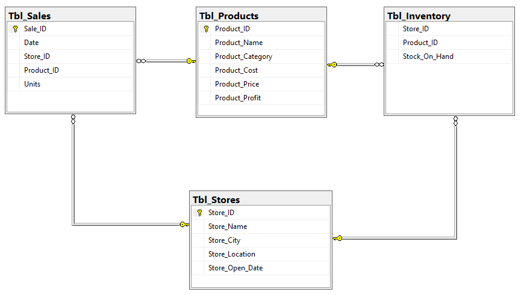

# Maven Toys Sales and Inventory Analysis
A SQL project that aim to provide Maven Toys, a fictional chain of toy stores in Mexico, with actionable insights into product profitability, seasonal sales trends, stock outs impact, and inventory efficiency.

## Project Overview
The Maven Toy Sales and Inventory Analysis project aim to provide Maven Toys, a fictional chain of toy stores in Mexico, with actionable insights into product profitability, seasonal sales trends, stockouts impact, and inventory efficiency.

This project aims to conduct a thorough analysis of Maven Toys' data to identify key areas for improvement and optimization.

## Project Scope

This project encompasses a detailed analysis of Maven Toys' sales and inventory data, including products, stores, daily sales, and inventory levels. The analysis covers historical data from January 1, 2022 to September 30, 2023 to provide a comprehensive view of Maven Toys' operational performance.

## Business Objective

The main goals of the Maven Toys Sales and Inventory project are to find the product categories that bring in the most profits and check if these categories are consistently profitable in all store locations. Additionally, aim to discover patterns and trends in sales over different time periods, identify any potential loss of sales due to out-of-stock products at specific locations, and determine the amount of money tied up in inventory at the toy stores and how long it will last.

## Document Purpose

This documentation serves as a guide for project stakeholders, providing insights into the project's objectives, data sources, data analysis, and any other relevant information. 

## Use Case

Different stakeholders within the organization could leverage these findings to enhance their respective functions. Here are key stakeholders who could make use of this analysis and benefit from it.

**1. Maven Toys Executives and Management:** Executives and upper management can use the analysis to make informed decisions about product offerings, store locations, and overall business strategy.

**2. Store Managers:** Store managers can benefit from insights into product performance, seasonal trends, and inventory management strategies to optimize their individual store operations.

**3. Inventory Managers:** Those responsible for inventory can use the analysis to refine stocking strategies, identify slow-moving items, and reduce instances of stockouts.

**4. Marketing Teams:** Marketing teams can leverage the analysis to tailor promotional strategies, especially during peak seasons, and align marketing efforts with the most profitable product categories.

**5. Sales Teams:** Sales teams can benefit from understanding customer preferences, popular products, and identifying potential sales opportunities based on the analysis.

## Skills Demostrated
- Data Connection in Microsoft SQL Server
- Data Cleaning and Processing
- Developed a Database Schema
- Data Analysis
- Join
- CTE (Common Table Expression)
- SQL Window Functions

## Data Source

The project utilizes a dataset containing information on sales and inventory. The dataset used for this analysis was downloaded from [Maven Analytics](https://www.mavenanalytics.io/data-playground?page=7&pageSize=5) website where datasets are available for practice purpose. The dataset is a CSV file and it consist four main tables which are sales table, product table, inventory table, and store table.

The sales table comprises 829,262 rows and 5 columns, capturing information about products sold and their quantities. This table serves to provide insights into daily sales activities, featuring columns such as Sale ID, Date, Store ID, Product ID, and Units.

The product table encompasses 35 rows and 5 columns, providing details about the products offered by Maven Toys. Each product is uniquely identified by a Product ID, and the table includes information such as Product Name, Product Category, Product Cost, and Product Price.

Inventory table consists of 1,593 rows and 3 columns, detailing the current stock levels of each product in every store. The columns include Product ID, Store ID, and Stock on Hand.

Store table comprises 50 rows and 5 columns, featuring information about Maven Toys' stores. The columns include Store ID, Store Name, Store City, Store Location, and Store Open Date.

All tables were then imported into Microsoft SQL Server.

## Data Cleaning and Processing

Data cleaning is essential because the quality of analysis and insights derived from data depends heavily on the accuracy and reliability of the input data. Flawed or inconsistent data can lead to incorrect conclusions and hinder decision-making. By thoroughly cleaning and preparing the data, I can ensure that my analyses are based on a solid foundation, leading to more reliable results and informed decision-making.

Thorough data cleaning processes were executed on every table involved in the analysis. The following procedures were undertaken for each table to ensure high data integrity, data accuracy and enhance high quality of the dataset.

**1. Identification and Handling of Null Values:** 

Rigorous checks were performed to identify and appropriately handle any instances of null values on the key columns within each table. Null values in this dataset indicate missing or incomplete information. Therefore, addressing rows with null values helps preserve the overall integrity of the dataset by ensuring that each observation contains complete information. Analyzing incomplete data may lead to misleading results. 

Upon executing a query to identify null values in each table, the resulting output confirms that every table involve in this analysis contains complete information. Importantly, there are no instances of null values detected in the key columns across all tables, highlighting the completeness and data integrity of the dataset used for this analysis.

**2. Dealing with Duplicates:**

Identified and removed duplicate records to avoid redundancy and maintain data integrity.

After running a query to find and remove all duplicate rows in each table, it has been confirmed that every table used in this analysis is free of duplicate rows. Each row in these tables contains unique information, ensuring the integrity of the dataset and providing distinct and valuable data for the analysis.

**3. Validation of Spelling and Categorization:**

A meticulous review was conducted to validate the correctness of spellings and the accuracy of categorization within each table, ensuring consistency and reliability.

**4. Correcting Data Types:**

Ensured that data types are appropriate for the values in each column, converting datatype if needed.

**5. Standardizing Data:**

Ensuring consistency in the format and representation of data, such as standardizing date formats and text case.

The following processes were also carried out during data processing.

- **Added a new Column**

A new column called "product profit" was added to the product table, calculating the profit for each product. This column is crucial for figuring out which product category is making the most profit, providing valuable insights into the most financially rewarding product categories.

New columns were also added to the sales table. These are Weekday, Month Number, Month Name, and Year, these additions are crucial for a thorough look at sales trends. With these columns, businesses can easily see patterns like which days, months, or years have higher sales. This information helps make smart decisions about things like stocking up on products, planning promotions, and overall business strategies.

- **Established Relationships Between Tables**

Creating relationships between tables is crucial for this analysis. It not only keeps the data organized but also helps in making queries faster, avoiding unnecessary duplication of data, and building a flexible database structure


Relationships enable the use of JOIN operations in queries, allowing data from multiple tables to be combined and retrieved in a single query. This leads to more efficient and streamlined data retrieval. By establishing relationships, it helps to avoid duplicating information in multiple tables and make the database more efficient in terms of storage and easier to maintain. Relationships provide a clear representation of the connections between different entities in the database. This makes the database structure more understandable and facilitates effective data modeling.

# Data Analysis and Insight

The objectives of this project are to find the product categories that bring in the most profits and check if these categories are consistently profitable in all store locations. Additionally, to discover patterns and trends in sales over different time periods, identify any potential loss of sales due to out-of-stock products at specific locations, and determine the amount of money tied up in inventory at the toy stores and how long it will last.

This analysis provides answers to the following questions

**1. Which product categories drive the biggest profits? Is this the same across store locations?**

This question is seeking to understand the relationship between product categories, profitability, and potential variations across different store locations. 

The first part of the question aims to identify and prioritize product categories that contribute significantly to the overall profitability of the business. To address this question, a thorough SQL query was executed to calculate the overall profit generated by each product category, along with the percentage contribution of each category to the total profit. This query provides a comprehensive overview of the profitability distribution across product categories.


```SQL
--Profit by Product Category

SELECT		Product_Category,
		ROUND(SUM(Product_Profit*Tbl_Sales.Units), 0) AS Total_Profit,
		ROUND(SUM(Product_Profit*Tbl_Sales.Units)/(SELECT SUM(Product_Profit*Tbl_Sales.Units) 
FROM		Tbl_Products
JOIN		Tbl_Sales
ON		Tbl_Products.Product_ID = Tbl_Sales.Product_ID)*100,2) AS [%Profit]
FROM		Tbl_Products
JOIN		Tbl_Sales
ON		Tbl_Products.Product_ID = Tbl_Sales.Product_ID
GROUP BY	Product_Category
ORDER BY	SUM(Product_Profit*Tbl_Sales.Units) DESC
```
|Product_Category|Total_Profit|%Profit|
|----------------|------------|-------|
|Toys|1079527|26.89|
|Electronics|1001437|24.95|
|Art & Crafts|753354|18.77|
|Games|673993|16.79|
|Sports & Outdoors|505718|12.6|

- From the above analysis, Toys generated the highest profit among the mentioned categories, totaling $1,079,527, contributing 26.89% of the total profit. This indicates that the Toys category is a significant contributor to the overall profitability.
- Electronics and Art & Crafts follow closely behind Toys in terms of profitability, with profits of $1,001,437 and $753,354, contributing 24.95% and 18.77% of the total profit respectively. These categories are also substantial contributors to the overall profit.
- Games and Sports & Outdoors generated profits of $673,993 and $505,718, contributing 16.79% and 12.60% of the total profit respectively. While still contributing significantly to the overall profit, they are less profitable compared to Toys, Electronics, and Art & Crafts.

The second part of the question explores whether the profitability of product categories remains consistent or varies across different store locations. It suggests an investigation into whether certain product categories perform exceptionally well in specific stores or if the profitability distribution is uniform across all locations. To provide answer to the second part of the question, a comprehensive SQL query that calculate the total profit generated by each product category across different store location was executed.

```SQL
--Profit by Product Category and Store Location

WITH CTE
AS
(SELECT		Store_Location,
		Product_Category,
		ROUND(SUM(Product_Profit*Tbl_Sales.Units), 0) AS Total_Profit
FROM		Tbl_Products
JOIN		Tbl_Sales
ON		Tbl_Products.Product_ID = Tbl_Sales.Product_ID
JOIN		Tbl_Stores
ON		Tbl_Stores.Store_ID = Tbl_Sales.Store_ID
GROUP BY	Product_Category,
		Store_Location)
SELECT		Store_Location,
		[Toys],
		[Electronics],
		[Art & Crafts],
		[Games],
		[Sports & Outdoors]   
FROM		CTE
PIVOT(		SUM (Total_Profit)
		FOR Product_Category
		IN  ([Toys], [Electronics], [Art & Crafts], [Games], [Sports & Outdoors])) AS PIV
ORDER BY	Store_Location
```

|Store_Location|Toys|Electronics|Art & Crafts|Games|Sports & Outdoors|
|--------------|----|-----------|------------|-----|-----------------|
|Airport|88250|108197|61441|80768|39393|
|Commercial|225034|287574|155461|146296|112499|
|Downtown|630029|502490|444320|378421|293468|
|Residential|136214|103176|92132|68508|60358|

- From the above analysis, profitability for each product category varies significantly across different store locations. Each location has a different top-performing category in terms of profitability. In Airport location, Electronics is the top-performing category. In Commercial location, Electronics is also the top-performing category. In Downtown location, Toys is the top-performing category while in Residential location, Toys is also the top-performing category.
- Electronics emerges as the dominant and most profitable category in both Airport and Commercial locations. This suggests a higher demand for electronics products in these settings, possibly driven by the traveler demographic in airports and the commercial nature of the business district.
- The Toys category consistently appears as the top-performing category in both Downtown and Residential locations, indicating its strong market appeal in these settings.


